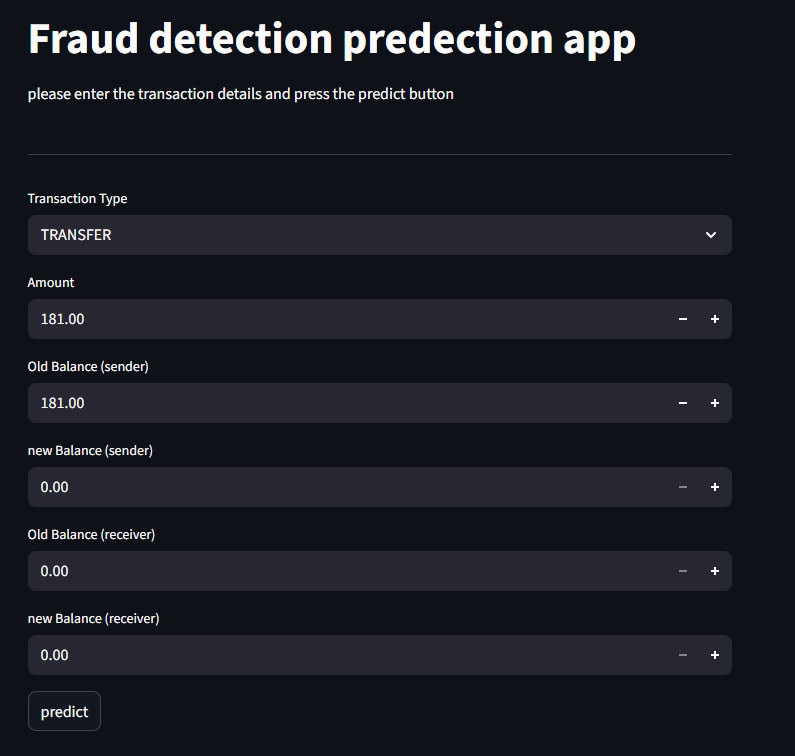

# 💳 Fraud Detection Model (Python + Streamlit)

## 📌 Overview
This project is a **Fraud Detection System** built with **Python** and **Machine Learning**.  
It uses transaction data to predict whether a financial transaction is fraudulent or legitimate.  
The project also includes a **Streamlit web app** for interactive predictions.

  

---

## 🚀 Features
- Pre-trained machine learning pipeline stored as `fraud_detection_pipeline.pkl`
- Streamlit web interface for user-friendly interaction
- Input fields for transaction details (amount, balances, type, etc.)
- Real-time fraud prediction
- Alerts when a transaction looks suspicious

---

## 🛠️ Tech Stack
- **Python 3.11+**
- **scikit-learn** (machine learning)
- **pandas** (data manipulation)
- **joblib** (model persistence)
- **Streamlit** (web app)

---

## 📂 Project Structure
FraudDetection/
│
├── fraudDetection.py
├── fraud_detection_pipeline.pkl 
├── requirements.txt 
└── README.md

---

## ⚙️ Installation & Setup

### 1. Clone the repository || Download folder
### 2. Install dependencies
### 4. Run the Streamlit app
- streamlit run fraudDetection.py

### 🖥️ Usage

- Enter the transaction details (type, amount, balances).

- Click Predict.

- The model outputs:

# Fraudulent → 🚨 flagged as suspicious

# Legitimate → ✅ safe transaction

### 📊 Model Training (Summary)

- Dataset: [Financial transaction dataset] (from Kaggle)

- Preprocessing: Handling categorical features (OneHotEncoding), scaling (StandardScaler)

- Model: Logistic Regression

- Export: Model pipeline saved with joblib
